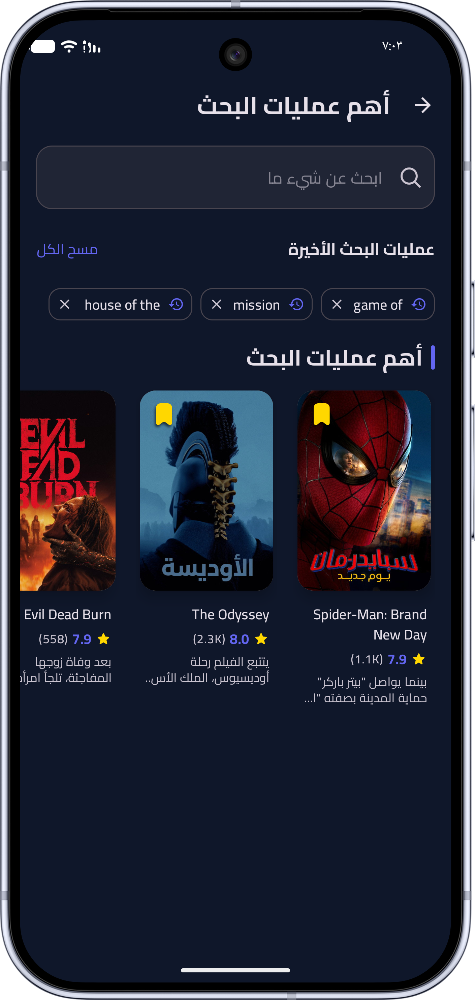
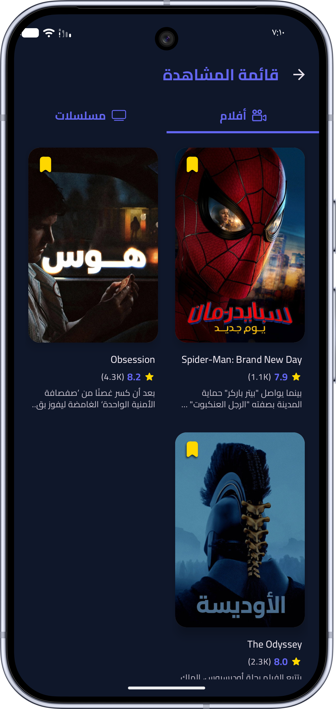
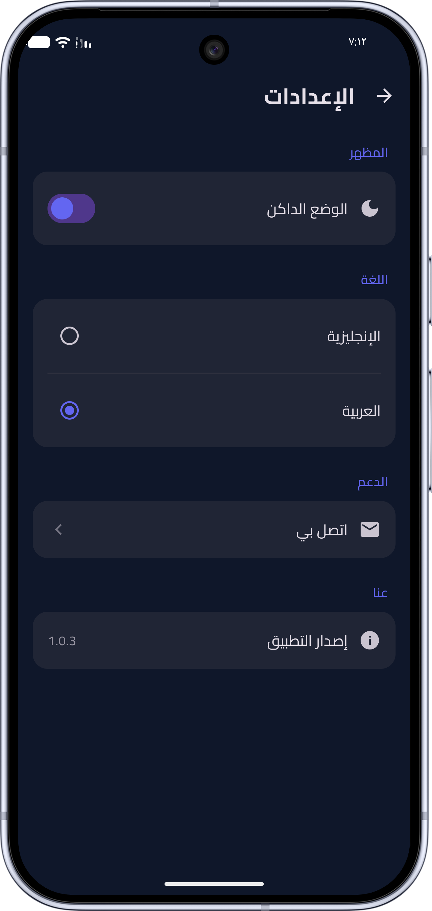

<p align="center">
  
</p>

<h1 align="center">🎬 El Sahra</h1>

<p align="center">
Ultimate Movie & TV Discovery App built with Jetpack Compose
</p>

<p align="center">
A modern Android application for discovering Movies and TV Shows with a beautiful UI, adaptive layouts, offline support, and a production-ready architecture.
</p>

<p align="center">
  
  
  
  
  
</p>

---

## ✨ Overview

**El Sahra** is a modern Android application built using **Jetpack Compose** and **Clean Architecture** that delivers a smooth movie and TV discovery experience powered by **The Movie Database (TMDB)**.

The app focuses on performance, scalability, responsive UI, offline support, and an intuitive user experience across phones, tablets, and foldable devices.

---

# 📱 Features

## 🎬 Content Discovery

- Browse both **Movies** and **TV Shows**
- Dynamic Home screen featuring:
  - 🔥 Trending
  - ⭐ Popular
  - 🏆 Top Rated
  - 🎥 Now Playing
- Beautiful Hero Banner showcasing trending content
- Infinite scrolling using **Paging 3**
- Dedicated "See All" screens for every category

---

## 📖 Rich Media Details

Every movie and TV show includes:

- Complete overview
- Ratings
- Release information
- Genres
- Runtime
- Cast & Crew
- User Reviews
- Similar Content
- Recommended Content
- Official Trailers
- High-quality posters & backdrops

---

## 🔍 Powerful Search

- Real-time search
- Search Movies
- Search TV Shows
- Search Actors
- Local Search History
- Browse by Genres

---

## ❤️ Personalization

- Save favorite Movies & TV Shows
- Offline Watchlist
- Persistent user preferences
- Light Theme
- Dark Theme

---

## 🌍 Internationalization

- English
- Arabic
- Full RTL Support
- Localized UI

---

## 📱 Adaptive UI

Built using modern adaptive layouts that automatically optimize the interface for:

- 📱 Phones
- 💊 Tablets
- 📖 Foldables

---

# 🏗 Architecture

The project follows **MVVM + Clean Architecture** principles.

```
Presentation
│
├── UI (Jetpack Compose)
├── ViewModels
│
Domain
│
├── Use Cases
├── Repository Interfaces
│
Data
│
├── Remote (TMDB API)
├── Local Database
├── Repository Implementations
```

### Architecture Benefits

- Scalable
- Testable
- Modular
- Maintainable
- Separation of Concerns

---

# 🛠 Tech Stack

| Category | Technology |
|----------|------------|
| Language | Kotlin |
| UI | Jetpack Compose |
| Architecture | MVVM + Clean Architecture |
| Dependency Injection | Hilt |
| Networking | Retrofit + OkHttp |
| Local Storage | Room |
| Preferences | Jetpack DataStore |
| Pagination | Paging 3 |
| Image Loading | Coil |
| Media Playback | Media3 ExoPlayer |
| Async Programming | Kotlin Coroutines |
| Reactive Streams | Kotlin Flow |
| API | TMDB API |

---

# 📂 Project Structure

```
app/
├── data/
│   ├── remote/
│   ├── local/
│   ├── repository/
│
├── domain/
│   ├── model/
│   ├── repository/
│   └── usecase/
│
├── presentation/
│   ├── screens/
│   ├── components/
│   ├── navigation/
│   └── viewmodel/
│
└── di/
```

---

# 📸 Screenshots

| Home | Search |
|------|--------|
|  |  |

| Search Results | Watchlist |
|----------------|-----------|
|  |  |

| Settings |
|----------|
|  |

---

# 🚀 Getting Started

## 1. Clone the repository

```bash
git clone https://github.com/your-username/ElSahra.git
```

---

## 2. Get a TMDB API Key

Create a free account at:

https://www.themoviedb.org/

Generate your API key from:

**Settings → API**

---

## 3. Add your API Key

Create or open:

```properties
local.properties
```

Add:

```properties
TMDB_API_KEY=YOUR_API_KEY
```

---

## 4. Build the Project

Open the project in **Android Studio** and run:

```
Build → Run App
```

---

# 🎯 Highlights

- 100% Jetpack Compose
- Modern Material 3 Design
- Clean Architecture
- Offline Watchlist
- Infinite Pagination
- Adaptive Layouts
- RTL Support
- Multi-language
- Smooth Animations
- Highly Scalable Codebase

---

# 📈 Future Improvements

- User Authentication
- Cloud Watchlist Sync
- Video Streaming Integration
- Download Manager
- Notifications
- AI-based Recommendations
- Chromecast Support

---

# 📄 License

This project is licensed under the **MIT License**.

---

# 🙏 Acknowledgements

- TMDB for providing the movie database API.
- Android Jetpack libraries.
- Kotlin community.

---

# 💡 Why "El Sahra"?

**El Sahra (السهرة)** means **"The Evening Gathering"** or **"A Night Out"** in Arabic.

The app is designed to be your perfect companion for discovering what to watch during your evenings, whether you're enjoying a movie alone, with friends, or with family.

---

## ⭐ If you like this project

Give it a ⭐ on GitHub and feel free to contribute!
